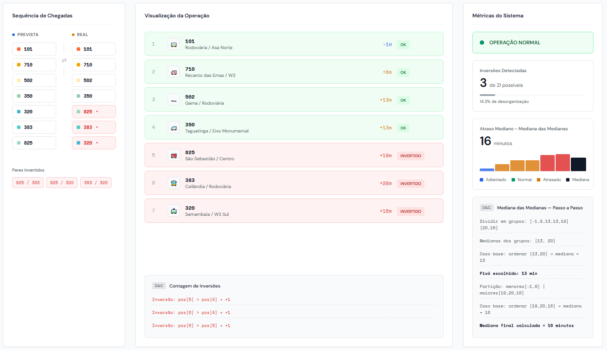
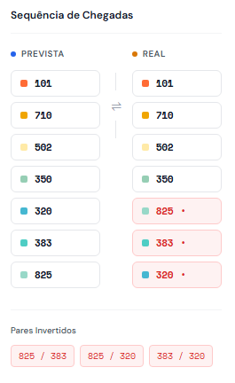
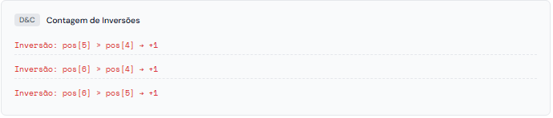
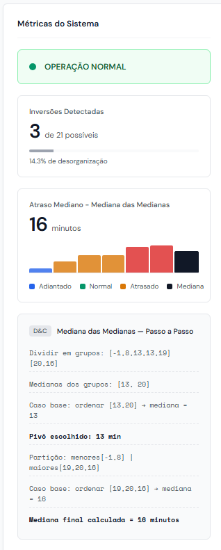

# BusMetrics

Número da Lista: 09<br>
Conteúdo da Disciplina: Dividir e Conquistar<br>

## Alunos
|Matrícula | Aluno |
| -- | -- |
| 23/1027023  |  Amanda Cruz Lima |
| 22/1031158  |  Felipe de Oliveira Motta |

## Sobre

O *BusMetrics* é uma ferramenta de simulação e análise de eficiência para frotas de ônibus. O objetivo do projeto é identificar o nível de desorganização (caos operacional) de uma linha de ônibus comparando a ordem real de chegada dos veículos com a ordem planejada, além de calcular estatísticas de atraso.

A aplicação utiliza dois algoritmos clássicos de *Dividir e Conquistar*:
1.  *Contagem de Inversões:* Utilizado para calcular o número de inversões entre a sequência planejada de ônibus e a sequência real. Quanto maior o número de inversões, maior o "índice de caos" da operação.
2.  *Mediana das Medianas:* Utilizado para encontrar de forma eficiente o valor mediano dos atrasos (delays) reportados pelos ônibus.

## Screenshots


1. Página



2. Inversões



3. Passos da Contagem de Inversões



3. Mediana das Medianas



## Instalação

```bash
# 1. Instale as dependências
pip install flask

# 2. Execute o servidor
python app.py

# 3. Acesse no navegador
http://localhost:5000
```
